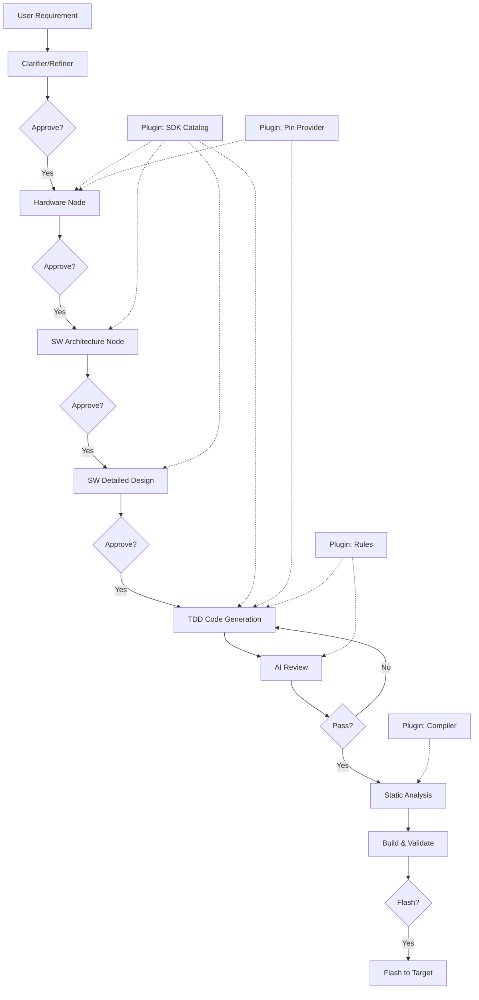

# ⚡ EmbedForge

**Agentic AI workflow for embedded C code generation.**

EmbedForge uses a multi-stage LLM pipeline with human-in-the-loop approval gates to generate production-quality embedded C firmware from natural language requirements. It supports any vendor SDK through a plugin architecture — bring your own HAL/drivers, board templates, and reference projects.

[](https://www.python.org/downloads/)
[](LICENSE)
[](https://fastapi.tiangolo.com/)
[](https://nuxt.com/)

---

## Key Features

- **Multi-stage AI pipeline** — Requirements → Hardware → Architecture → Design → Code
- **Human-in-the-loop** — approve/edit each stage before proceeding
- **TDD code generation** — mocks → failing tests → production code (Red-Green-Refactor)
- **Plugin architecture** — swap vendor SDKs without changing core logic
- **Compiler fix loop** — LLM-driven iterative error repair from build failures
- **AI code review** — automated review against SDK architecture rules
- **Static analysis** — cppcheck integration catches bugs the LLM misses
- **Firmware flashing** — pyOCD-based flash service with probe discovery
- **Pin validation** — catches invalid pin references before compilation
- **Multi-LLM support** — OpenAI, Azure OpenAI, Anthropic (Claude)
- **SDK Scanner** — point to any vendor SDK, auto-extract API metadata
- **Capability Profile Generator** — LLM-assisted profile creation from SDK headers
- **Reference Analyzer** — upload existing C projects to extract patterns
- **LLM-powered Chat** — context-aware assistant during pipeline stages
- **Optional RAG** — enhance context with vendor documentation (PDF/markdown)

## Architecture



## Quick Start

### 1. Install

```bash
git clone https://github.com/EchoSNS/embedforge.git
cd embedforge
uv venv
uv pip install -e .
```

### 2. Configure

```bash
cp .env.example .env
# Edit .env with your LLM API key
```

### 3. Run Backend

```bash
uv run uvicorn server.main:app --reload
```

### 4. Run Frontend

```bash
cd frontend
npm install
npm run dev
```

Open http://localhost:3000 and describe your embedded requirement.

## Plugin System

EmbedForge is **vendor-agnostic**. The bundled STM32 HAL plugin serves as both a working example and a reference for creating your own.

### Bundled: STM32 HAL

Works out of the box — GPIO, PWM (TIM), ADC, UART, SPI, I2C drivers for STM32F4.

### Create Your Own Plugin

```
plugins/your_sdk/
├── __init__.py       # PluginManifest + register()
├── catalog.py        # DriverCatalog implementation
├── pins.py           # PinCapabilityProvider implementation
├── compiler.py       # CompilerBackend implementation
├── rules.py          # ArchitectureRulePack implementation
└── boards.py         # BoardTemplate implementations
```

Each plugin implements 5 interfaces from `plugins/base.py`:

| Interface | Responsibility |
|-----------|---------------|
| `DriverCatalog` | List/recommend SDK drivers for a peripheral |
| `PinCapabilityProvider` | Validate pin symbols, enumerate capabilities |
| `CompilerBackend` | Compile code, parse errors |
| `ArchitectureRulePack` | SDK coding rules for LLM and validation |
| `BoardTemplate` | Board config, include paths, skeleton files |

See [docs/PLUGIN_DEVELOPMENT.md](docs/PLUGIN_DEVELOPMENT.md) for the full guide.

## Project Structure

```
embedforge/
├── app.py                  # Entry point (uvicorn launcher)
├── server/                 # FastAPI backend (REST + WebSocket)
│   ├── main.py             # App factory, CORS, plugin loading
│   ├── ws.py               # WebSocket (LLM-powered chat + progress)
│   └── routes/
│       ├── workflow.py     # Pipeline start/approve/edit/build/validate/analyze
│       ├── plugins.py      # Board/driver discovery
│       ├── sdk.py          # SDK scan, profile generate/edit, reference upload
│       └── flash.py        # Probe discovery, firmware flashing, target reset
├── frontend/               # Nuxt 3 dashboard (Tailwind + Lucide)
│   ├── pages/
│   │   ├── index.vue       # Main workspace (prompt → pipeline → code)
│   │   └── settings.vue    # SDK Scanner, Profile Editor, Reference Analyzer
│   ├── components/         # UI components (pipeline, chat, code viewer)
│   └── composables/        # API composables (useWorkflow, useSdkManager)
├── core/                   # Workflow engine & core services
│   ├── workflow.py         # State machine (pipeline orchestration)
│   ├── profile_generator.py # LLM-assisted capability profile generation
│   ├── sdk_analyzer.py     # SDK header parser (any C SDK)
│   ├── reference_analyzer.py # Reference project pattern extraction
│   ├── tdd_generator.py    # TDD code generation pipeline
│   ├── compiler_fix_loop.py # LLM-driven compilation error repair
│   ├── code_validator.py   # Pre-compilation validation (+ cppcheck)
│   ├── static_analyzer.py  # cppcheck static analysis integration
│   ├── pin_validator.py    # Pin symbol validation
│   ├── ai_reviewer.py      # AI code review
│   └── dynamic_prompts.py  # Runtime prompt builder
├── plugins/                # Vendor SDK plugins
│   ├── base.py             # Interface definitions + CapabilityProfile
│   └── stm32_hal/          # Bundled STM32 HAL plugin
│       ├── profile.yaml    # Capability profile (peripherals, patterns)
│       └── reference_snippets/ # Golden code examples
├── prompts/                # Stage system prompts (source of truth)
├── config/                 # LLM & app configuration
├── services/               # Build & flash service abstractions
├── rag/                    # Optional RAG module (ChromaDB)
├── unity/                  # Unity C test framework
├── docs/                   # Documentation
├── examples/               # Example inputs/outputs
└── tests/                  # Unit & integration tests
```

## Supported LLM Providers

| Provider | Env Vars | Model Examples |
|----------|----------|----------------|
| OpenAI | `OPENAI_API_KEY`, `OPENAI_MODEL` | gpt-4, gpt-4o |
| Azure OpenAI | `AZURE_OPENAI_ENDPOINT`, `AZURE_OPENAI_API_KEY`, `AZURE_OPENAI_DEPLOYMENT` | gpt-4 deployment |
| Anthropic | `ANTHROPIC_API_KEY`, `ANTHROPIC_MODEL` | claude-sonnet-4-20250514 |

## Docker

```bash
docker build -t embedforge .
docker run -p 8000:8000 --env-file .env embedforge
```

## Documentation

- [Getting Started](docs/GETTING_STARTED.md)
- [Architecture](docs/ARCHITECTURE.md)
- [Plugin Development](docs/PLUGIN_DEVELOPMENT.md)
- [Contributing](docs/CONTRIBUTING.md)
- [RAG Setup](docs/RAG_SETUP.md) (optional)

## How It Works (For AI/ML Engineers)

EmbedForge is a **LangGraph-compatible multi-node state machine** where each node:
1. Receives the current workflow state
2. Builds a dynamic LLM prompt using plugin-provided SDK metadata
3. Invokes the LLM (structured JSON output)
4. Validates the output against SDK rules
5. Pauses for human approval

The **TDD code generation** node is the most complex — it runs a 3-phase sub-pipeline:
- **Red**: Generate mock SDK stubs + Unity tests that define expected behavior
- **Green**: Generate production code to pass the tests
- **Refactor**: AI review + optional compiler fix loop

This approach produces code that is both LLM-generated AND verifiably correct against the test specification.

## Contributing

See [CONTRIBUTING.md](docs/CONTRIBUTING.md). PRs welcome — especially new plugins!

## License

MIT — see [LICENSE](LICENSE).
