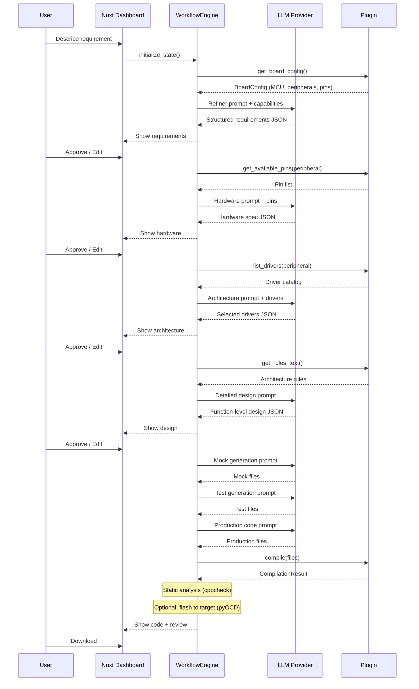

# Architecture

EmbedForge is a multi-stage agentic AI pipeline that generates embedded C firmware from natural language requirements. This document describes the system design for contributors and integrators.

## Design Principles

1. **Dependency Inversion** — Core modules depend on abstract interfaces (`plugins/base.py`), not vendor implementations
2. **Single Responsibility** — Each module handles one concern (pin validation, driver selection, compilation, etc.)
3. **Open/Closed** — New vendor SDKs added via plugins without modifying core
4. **Interface Segregation** — Five focused interfaces rather than one monolithic plugin contract
5. **Human-in-the-Loop** — Every stage pauses for approval; users can edit any intermediate output

## System Overview

```
┌─────────────────────────────────────────────────────────────┐
│                  Nuxt 3 Dashboard (frontend/)                  │
├─────────────────────────────────────────────────────────────┤
│                 FastAPI Backend (server/)                       │
│  ┌──────┐  ┌────────┐  ┌──────┐  ┌───────┐  ┌──────────┐ │
│  │Refine│→ │Hardware│→ │SW Arc│→ │Detailed│→ │  CodeGen │ │
│  └──────┘  └────────┘  └──────┘  └───────┘  └──────────┘ │
├─────────────────────────────────────────────────────────────┤
│                     Core Services Layer                      │
│  DriverCatalog · PinValidator · Compiler · SDKAnalyzer      │
│  ReferenceAnalyzer · TDDGenerator · AIReviewer              │
│  StaticAnalyzer · FlashService                              │
├─────────────────────────────────────────────────────────────┤
│                     Plugin Interface Layer                   │
│  DriverCatalog · PinCapabilityProvider · CompilerBackend    │
│  ArchitectureRulePack · BoardTemplate                       │
├─────────────────────────────────────────────────────────────┤
│              Plugin Implementation (e.g. stm32_hal)         │
│  STM32DriverCatalog · STM32PinProvider · ARMGCCCompiler    │
│  STM32ArchitectureRules · NucleoF446RE                     │
└─────────────────────────────────────────────────────────────┘
```

## Capability Profiles

Each plugin can declare a `profile.yaml` manifest that describes SDK capabilities declaratively:

```yaml
vendor: STMicroelectronics
sdk: STM32 HAL
peripherals:
  PWM:
    instances: [TIM1, TIM2, TIM3]
    features: [complementary_outputs, dead_time]
patterns:
  init_sequence: [HAL_Init, SystemClock_Config, GPIO_Init, ...]
  naming_conventions: {config_struct_suffix: "_InitTypeDef"}
constraints:
  - "TIM1/TIM8 are advanced-control timers"
```

Profiles can be:
- **Hand-written** by SDK experts
- **Auto-generated** from SDK headers using the SDK Scanner + Profile Generator
- **LLM-assisted** — the system infers capabilities from function signatures

The `CapabilityProfile` is injected into LLM prompts at each stage for grounded generation.

## Device Data System

Hardware knowledge is layered, with each layer providing different ground-truth:

```
┌─────────────────────────────────────────────────────────────┐
│ Layer 3: RAG (PDF datasheets)                               │
│   Electrical constraints, timing, errata                     │
├─────────────────────────────────────────────────────────────┤
│ Layer 2: Pin Mux Database (CubeMX/ATDF/PDSC)               │
│   Complete pin-to-AF mapping per MCU package                 │
├─────────────────────────────────────────────────────────────┤
│ Layer 1: SVD / Register Maps                                │
│   Peripheral registers, bit fields, interrupts              │
├─────────────────────────────────────────────────────────────┤
│ Layer 0: SDK Header Scan                                    │
│   API functions, types, constants                            │
└─────────────────────────────────────────────────────────────┘
```

**Device DB** (`core/device_db.py`): SQLite-backed store for imported device data.
Populated by vendor-specific importers:

| Importer | Source | Vendor Coverage |
|----------|--------|-----------------|
| `CubeMXImporter` | CubeMX `db/mcu/*.xml` | STM32 (all families) |
| `SVDParser` | CMSIS-SVD `.svd` files | All ARM vendors |
| `CMSISPackImporter` | `.pack` ZIP archives | All ARM vendors (auto-extracts SVD) |
| `ATDFImporter` | Microchip `.atdf` files | AVR, SAM |
| `ILLDPinExtractor` | iLLD `*_PinMap.h` headers | Infineon AURIX (TriCore) |

**Bulk Import:** `POST /api/sdk/device/import-bulk` imports up to 200 devices
at once from a single source path. Progress streamed via activity log SSE.

**Supported Plugins:**

| Plugin | Vendor | Boards | Key Drivers |
|--------|--------|--------|-------------|
| `stm32_hal` | STMicroelectronics | NUCLEO-F446RE | HAL_UART, HAL_TIM, HAL_SPI, HAL_I2C, HAL_ADC |
| `nxp_mcuxpresso` | NXP | LPCXpresso55S69 | fsl_usart, fsl_spi, fsl_i2c, fsl_ctimer |
| `nordic_nrfconnect` | Nordic | nRF52840-DK | nrfx_uarte, nrfx_spim, nrfx_twim, nrfx_pwm |
| `espressif_idf` | Espressif | ESP32-DevKitC | driver/uart, ledc, mcpwm, adc_oneshot |
| `infineon_mtb` | Infineon | CY8CPROTO-062-4343W | cyhal_uart, cyhal_spi, cyhal_pwm, Cy_SCB |
| `renesas_fsp` | Renesas | EK-RA6M5 | r_sci_uart, r_spi, r_gpt, r_adc |
| `ti_simplelink` | Texas Instruments | CC26X2R1-LAUNCHXL | UART2, SPI, I2C, PWM, GPIO |
| `microchip_harmony` | Microchip | SAM-E54-Xplained-Pro | SERCOM_USART, TCC_PWM, ADC_PLIB |
| `silabs_gecko` | Silicon Labs | BRD4187C (EFR32MG24) | em_usart, em_timer, em_iadc, em_gpio |
| `infineon_aurix` | Infineon (AURIX) | TC4D7 Lite Kit | IfxAsclin, IfxQspi, IfxGtm, IfxVadc, IfxMultican |

**Auto-Discovery** (`core/auto_discovery.py`): Detects installed SDKs and
toolchains by scanning known paths and environment variables. Returns
importable sources for one-click device data import.

**Pin validation strategy:** Structural validation (pattern-based, e.g. `P[A-K]0-15`
for STM32) as baseline. When device data is imported, the system uses ground-truth
pin-AF tables. The LLM receives complete AF context in hardware-stage prompts.

## Data Flow



## Workflow State Model

```python
@dataclass
class WorkflowState:
    session_id: str
    stage: WorkflowStage        # Current pipeline position
    user_input: str             # Original requirement text
    board_name: str             # Selected board from plugin

    # Stage outputs (each approved by user)
    requirements: Dict          # Structured from refiner
    hardware_spec: Dict         # Peripheral/pin assignments
    software_arch: Dict         # Selected drivers + architecture
    software_detailed: Dict     # Function-level design
    generated_code: Dict[str, str]  # filename → content
    review_result: Dict         # AI review outcome
    build_result: Dict          # Compilation outcome

    # Context (injected into prompts)
    sdk_capabilities: Dict      # From plugin board config
    reference_analysis: Dict    # From uploaded reference project
    pin_context: str            # Formatted validated pins
    driver_context: str         # Formatted driver catalog
```

## Plugin Interface Contracts

### DriverCatalog
- `list_peripherals()` → all supported peripheral types
- `list_drivers(peripheral)` → drivers sorted by abstraction level
- `recommend_driver(peripheral, requirements)` → best-fit driver
- `get_driver_functions(name)` → API function signatures
- `get_driver_types(name)` → struct/enum definitions

### PinCapabilityProvider
- `get_available_pins(peripheral, function)` → valid pin mappings
- `validate_pin(symbol)` → True/False
- `validate_assignment(assignments)` → error list
- `get_pin_patterns()` → regex patterns for code scanning

**Pin validation strategy:** Rather than maintaining an exhaustive per-MCU pin
database (unmaintainable across thousands of MCU variants), the system uses
structural validation: any symbol matching the vendor's naming pattern
(e.g., `P[A-K]0-15` for STM32) passes validation. The LLM is guided toward
correct pin choices by the capability profile and board context injected into
prompts. The pin provider can dynamically enrich its knowledge by parsing
SDK headers (GPIO AF definitions) when an SDK path is configured.

**Hardware knowledge layers:**
1. SDK headers → API functions, register defines, AF constants (automated)
2. Capability profile → peripheral instances, features, constraints (SDK scan + LLM)
3. Board context → onboard resources, VCP pins, LEDs (minimal bootstrap)
4. Datasheet/RM knowledge → injected via RAG or reference projects (optional)

### CompilerBackend
- `is_available()` → toolchain installed?
- `compile(sources, includes, output, mcu, flags)` → CompilationResult
- `parse_errors(stderr)` → structured error list

### ArchitectureRulePack
- `get_rules_text()` → full rules for LLM injection
- `get_init_pattern(driver)` → canonical init code
- `get_naming_conventions()` → naming rules dict
- `validate_code(code)` → violation list

### BoardTemplate
- `get_config()` → BoardConfig (MCU, clock, peripherals)
- `get_sdk_include_paths()` → compiler -I paths
- `get_template_files()` → skeleton project files
- `get_linker_script()` → memory layout

## TDD Generation Pipeline

The code generation node implements Test-Driven Development:

1. **Mock Generation** — Create stubs for all SDK functions with spy counters
2. **Test Generation** — Write Unity tests that define expected behavior (Red)
3. **Production Code** — Generate implementation that passes tests (Green)
4. **Validation** — Compile mocks + tests + production with Unity (optional)

This ensures generated code is verifiable against a test specification,
not just "looks correct" to the LLM.

## Compiler Fix Loop

When compilation fails:
1. Parse structured errors from compiler output
2. Gather SDK API reference for the failing functions
3. Send errors + code + reference to LLM
4. LLM returns corrected files
5. Re-compile
6. Repeat (max 5 iterations, decreasing temperature)

## Static Analysis (cppcheck)

After code generation, `core/static_analyzer.py` optionally runs cppcheck:
- Detects null pointer dereferences, buffer overflows, unused variables
- Integrated into `CodeValidator.validate()` as an automatic pass
- Available as a standalone endpoint: `POST /api/workflow/{id}/analyze`
- Results are categorized by severity: error, warning, style, performance, portability
- Critical issues (errors) are escalated to the validation report

Requires `cppcheck` in PATH. If unavailable, the pass is silently skipped.

## Firmware Flashing (pyOCD)

`services/flash_service.py` provides firmware flashing via pyOCD:
- Probe discovery: `GET /api/flash/probes`
- Flash binary: `POST /api/flash/program`
- Target reset: `POST /api/flash/reset`
- Supports ST-LINK, CMSIS-DAP, and J-Link debug probes

Requires `pip install pyocd` (optional dependency via `pip install -e ".[flash]"`).

## Configuration

- **LLM**: `config/llm_config.py` — multi-provider factory from env vars
- **App**: `config/settings.py` — plugin name, output dir, log level
- **Plugins**: auto-discovered from `plugins/` directory at startup

## Cost Tracking & Observability

### Auto-Instrumented Cost Tracking

Every LLM call is metered automatically. `get_llm(session_id, stage)` attaches a
`CostTrackingCallback` that intercepts token counts from:

1. `response.usage_metadata` (modern LangChain — actual provider-reported tokens)
2. `response.llm_output.token_usage` (classic OpenAI/Azure path)

**Pricing**: Built-in table for common models + `EMBEDFORGE_COST_OVERRIDES` env var
for custom deployments. Exposed via `GET /api/cost/pricing`.

### Metrics Dashboard (`/metrics`)

- **Cost over time** — configurable bucket size (5min, 15min, hourly, daily)
- **Cost by stage** — breakdown showing which pipeline stages are most expensive
- **Performance table** — calls, avg latency, tokens per stage
- **Recent calls** — detailed log of all LLM invocations
- **Cache stats** — hit rate, entries, clear button

### Budget Alerts

- `EMBEDFORGE_BUDGET_USD` env var sets a spending cap
- `PUT /api/cost/budget` sets it at runtime
- Budget status shown in metrics sidebar with color-coded progress bar
- Callbacks fired when budget is exceeded

### LLM Response Cache (`core/llm_cache.py`)

SHA-256 keyed LRU cache that stores prompt→response pairs. When the exact same
system+user prompt is sent again, the cached response is returned instantly with
zero tokens consumed. Integrated into `WorkflowEngine._invoke_llm()`.

- `EMBEDFORGE_CACHE_SIZE` (default 100) controls max entries
- `GET /api/cost/cache` — hit/miss stats
- `DELETE /api/cost/cache` — clear cache

### Model-per-Stage Routing

Different stages can use different models to optimize cost:

```
EMBEDFORGE_STAGE_MODELS={"refiner": "gpt-4o-mini", "chat": "gpt-4o-mini"}
```

Configurable at runtime via Settings → Model Routing tab or `PUT /api/cost/stage-models`.
Stages not in the map use the default deployment.

### Structured Logging (`config/logging_config.py`)

JSON-formatted logs with session correlation IDs:
```json
{"ts": "...", "level": "INFO", "logger": "core.workflow", "msg": "...", "session_id": "abc123"}
```

## Security

### Prompt Injection Guard (`core/prompt_guard.py`)

User input is sanitized before embedding in LLM prompts:

- **12 detection patterns**: prompt_override, persona_hijack, role_injection,
  token_injection, fenced_injection, disregard_attack, instruction_replacement,
  rule_bypass, scenario_injection, prompt_leak, jailbreak_keyword,
  exfiltration_via_transform
- **Random delimiter fencing**: `wrap_user_content()` generates a per-call
  `EMBEDFORGE_{hex}` token pair so adversaries cannot predict the closing marker
- **Special token stripping**: `<|endoftext|>`, `<|im_start|>` etc. removed
- **Configurable truncation**: `EMBEDFORGE_MAX_INPUT_LENGTH` (default 5000 chars)
  with informative message telling users how to increase
- **Zero false positives** on legitimate embedded terms (tested against 5 real-world inputs)
- Applied at workflow entry (`initialize_state`) and WebSocket chat

### Path Traversal Protection

`/api/sdk/scan` validates paths against `EMBEDFORGE_SDK_ROOTS` (semicolon-separated
allowlist). If unset, all paths are accessible (dev mode only).

### Container Hardening

Dockerfile runs as non-root `appuser` with health check.

## Code Parsing

### Tree-sitter C Parser (`core/ts_parser.py`)

Replaces regex-based header parsing with proper AST analysis via `tree-sitter-c`.
Falls back to regex if tree-sitter fails.

**Measured improvement over regex** (on STM32 HAL-style headers):

| Category | Tree-sitter | Regex | Difference |
|----------|------------|-------|------------|
| Functions found | 8 | 5 | +60% |
| Types found | 2 | 1 | +100% |
| Macros found | 5 | 1 | +400% |

Edge cases tree-sitter handles correctly:
- `__attribute__((weak))` decorated functions
- Nested structs (`struct { struct { ... } inner; } Outer`)
- Function-like macros (`#define UNUSED(X) (void)X`)
- Multi-line `#define` with backslash continuation

### SDK Analyzer (`core/sdk_analyzer.py`)

Scans SDK header trees and extracts:
- Function signatures (name, return type, parameters)
- Struct/union/enum typedefs with fields
- `#define` macros

Output feeds the driver catalog, profile generator, and LLM context.

## Structured Output

All workflow stages use Pydantic schemas (`core/schemas.py`) with LangChain's
`with_structured_output()` to enforce valid JSON from the LLM. Falls back to
regex-based JSON extraction if structured output is unavailable.

Schemas: `RefinedRequirements`, `HardwareSpec`, `SoftwareArchitecture`,
`SoftwareDetailed`, `ReviewOutput`

## State Machine Rollback

`WorkflowState.rollback_to(stage)` allows returning to a previous stage:
- Clears all outputs after the target stage
- Preserves outputs up to and including the target
- Snapshots are saved before each stage execution
- `POST /api/workflow/{id}/rollback/{stage}` — API endpoint

## RAG Integration (Optional)

When `EMBEDFORGE_ENABLE_RAG=true`, the `RAGPipeline` provides vector search
over ingested vendor documentation (PDFs, datasheets, reference manuals).
Results are injected into the refiner prompt as additional context.

Requires: `pip install embedforge[rag]` (chromadb + sentence-transformers)

## Deterministic Validation

The review stage runs `CodeValidator` (deterministic checks) **before** the AI
reviewer to catch issues without consuming LLM tokens:

1. **Include resolution** — headers exist in SDK
2. **Pin validation** — symbols match MCU pin map
3. **Architecture rules** — HAL conventions checked via regex
4. **Syntax check** — brace balance

If deterministic checks fail, the AI reviewer is skipped entirely.

## Session Persistence (`server/session_store.py`)

Workflow sessions are persisted to SQLite (`sessions.db`) and survive server
restarts. The `SessionStore` has a dict-like interface (`store[id] = state`)
with an in-memory cache for fast access.

- `GET /api/workflow/sessions/list` — list recent sessions
- Sessions automatically saved on every state mutation
- Falls back to in-memory dict if SQLite is unavailable

## Build Sandbox (`core/build_sandbox.py`)

Compilation runs through `sandboxed_run()` which enforces:

- **Timeout**: `EMBEDFORGE_COMPILE_TIMEOUT` (default 120s)
- **Output cap**: 1 MB max stdout/stderr
- **Linux resource limits** (when running in Docker):
  - 512 MB virtual memory (`RLIMIT_AS`)
  - 60s CPU time (`RLIMIT_CPU`)
  - 50 MB max file output (`RLIMIT_FSIZE`)

## Build Templates (`core/build_templates.py`)

Generated code downloads can include CMakeLists.txt and Makefile:

- `GET /api/workflow/{id}/download?include_build=true`
- Auto-detects MCU flags from board config
- Supports STM32 (Cortex-M0/M4/M7), nRF52, ESP32 targets
- Includes linker script reference if available
