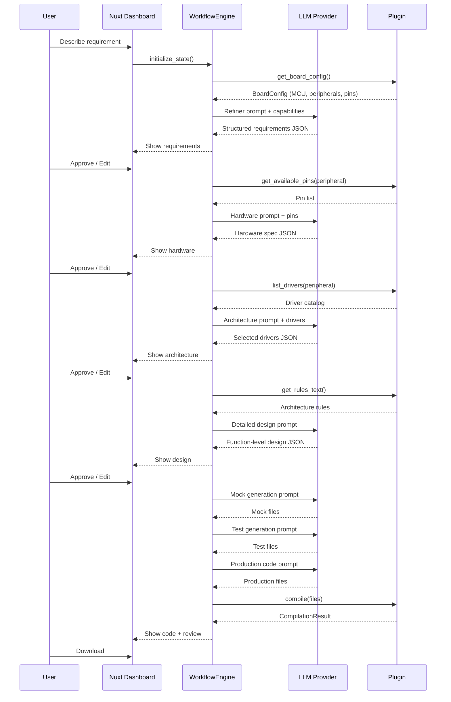

# Architecture

EmbedForge is a multi-stage agentic AI pipeline that generates embedded C firmware from natural language requirements. This document describes the system design for contributors and integrators.

## Design Principles

1. **Dependency Inversion** — Core modules depend on abstract interfaces (`plugins/base.py`), not vendor implementations
2. **Single Responsibility** — Each module handles one concern (pin validation, driver selection, compilation, etc.)
3. **Open/Closed** — New vendor SDKs added via plugins without modifying core
4. **Interface Segregation** — Five focused interfaces rather than one monolithic plugin contract
5. **Human-in-the-Loop** — Every stage pauses for approval; users can edit any intermediate output

## System Overview

```
┌─────────────────────────────────────────────────────────────┐
│                  Nuxt 3 Dashboard (frontend/)                  │
├─────────────────────────────────────────────────────────────┤
│                 FastAPI Backend (server/)                       │
│  ┌──────┐  ┌────────┐  ┌──────┐  ┌───────┐  ┌──────────┐ │
│  │Refine│→ │Hardware│→ │SW Arc│→ │Detailed│→ │  CodeGen │ │
│  └──────┘  └────────┘  └──────┘  └───────┘  └──────────┘ │
├─────────────────────────────────────────────────────────────┤
│                     Core Services Layer                      │
│  DriverCatalog · PinValidator · Compiler · SDKAnalyzer      │
│  ReferenceAnalyzer · TDDGenerator · AIReviewer              │
├─────────────────────────────────────────────────────────────┤
│                     Plugin Interface Layer                   │
│  DriverCatalog · PinCapabilityProvider · CompilerBackend    │
│  ArchitectureRulePack · BoardTemplate                       │
├─────────────────────────────────────────────────────────────┤
│              Plugin Implementation (e.g. stm32_hal)         │
│  STM32DriverCatalog · STM32PinProvider · ARMGCCCompiler    │
│  STM32ArchitectureRules · NucleoF446RE                     │
└─────────────────────────────────────────────────────────────┘
```

## Capability Profiles

Each plugin can declare a `profile.yaml` manifest that describes SDK capabilities declaratively:

```yaml
vendor: STMicroelectronics
sdk: STM32 HAL
peripherals:
  PWM:
    instances: [TIM1, TIM2, TIM3]
    features: [complementary_outputs, dead_time]
patterns:
  init_sequence: [HAL_Init, SystemClock_Config, GPIO_Init, ...]
  naming_conventions: {config_struct_suffix: "_InitTypeDef"}
constraints:
  - "TIM1/TIM8 are advanced-control timers"
```

Profiles can be:
- **Hand-written** by SDK experts
- **Auto-generated** from SDK headers using the SDK Scanner + Profile Generator
- **LLM-assisted** — the system infers capabilities from function signatures

The `CapabilityProfile` is injected into LLM prompts at each stage for grounded generation.

## Data Flow



## Workflow State Model

```python
@dataclass
class WorkflowState:
    session_id: str
    stage: WorkflowStage        # Current pipeline position
    user_input: str             # Original requirement text
    board_name: str             # Selected board from plugin

    # Stage outputs (each approved by user)
    requirements: Dict          # Structured from refiner
    hardware_spec: Dict         # Peripheral/pin assignments
    software_arch: Dict         # Selected drivers + architecture
    software_detailed: Dict     # Function-level design
    generated_code: Dict[str, str]  # filename → content
    review_result: Dict         # AI review outcome
    build_result: Dict          # Compilation outcome

    # Context (injected into prompts)
    sdk_capabilities: Dict      # From plugin board config
    reference_analysis: Dict    # From uploaded reference project
    pin_context: str            # Formatted validated pins
    driver_context: str         # Formatted driver catalog
```

## Plugin Interface Contracts

### DriverCatalog
- `list_peripherals()` → all supported peripheral types
- `list_drivers(peripheral)` → drivers sorted by abstraction level
- `recommend_driver(peripheral, requirements)` → best-fit driver
- `get_driver_functions(name)` → API function signatures
- `get_driver_types(name)` → struct/enum definitions

### PinCapabilityProvider
- `get_available_pins(peripheral, function)` → valid pin mappings
- `validate_pin(symbol)` → True/False
- `validate_assignment(assignments)` → error list
- `get_pin_patterns()` → regex patterns for code scanning

### CompilerBackend
- `is_available()` → toolchain installed?
- `compile(sources, includes, output, mcu, flags)` → CompilationResult
- `parse_errors(stderr)` → structured error list

### ArchitectureRulePack
- `get_rules_text()` → full rules for LLM injection
- `get_init_pattern(driver)` → canonical init code
- `get_naming_conventions()` → naming rules dict
- `validate_code(code)` → violation list

### BoardTemplate
- `get_config()` → BoardConfig (MCU, clock, peripherals)
- `get_sdk_include_paths()` → compiler -I paths
- `get_template_files()` → skeleton project files
- `get_linker_script()` → memory layout

## TDD Generation Pipeline

The code generation node implements Test-Driven Development:

1. **Mock Generation** — Create stubs for all SDK functions with spy counters
2. **Test Generation** — Write Unity tests that define expected behavior (Red)
3. **Production Code** — Generate implementation that passes tests (Green)
4. **Validation** — Compile mocks + tests + production with Unity (optional)

This ensures generated code is verifiable against a test specification,
not just "looks correct" to the LLM.

## Compiler Fix Loop

When compilation fails:
1. Parse structured errors from compiler output
2. Gather SDK API reference for the failing functions
3. Send errors + code + reference to LLM
4. LLM returns corrected files
5. Re-compile
6. Repeat (max 5 iterations, decreasing temperature)

## Configuration

- **LLM**: `config/llm_config.py` — multi-provider factory from env vars
- **App**: `config/settings.py` — plugin name, output dir, log level
- **Plugins**: auto-discovered from `plugins/` directory at startup
